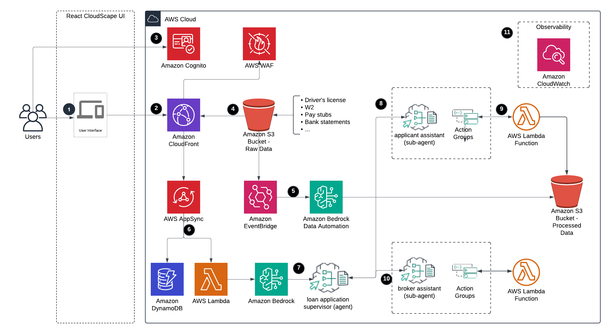

# Guidance for Agentic Workflows for Intelligent Document Processing on AWS

## Overview

This repository provides an automated document processing system that streamlines invoice processing through a simple file upload interface. The solution helps reduce manual processing time, minimize errors, and provides real-time processing status through AI-powered document processing using Amazon Bedrock Data Automation.

## Table of Contents

- [Overview](#overview)
- [Key Features](#key-features)
- [Architecture](#architecture)
  - [Architecture Diagram](#architecture-diagram)
  - [Provisioned Resources](#provisioned-resources)
- [User Interface](#user-interface)
- [Deployment Steps](#deployment-steps)
  - [Prerequisites](#prerequisites)
  - [Quick Start](#quick-start)
- [Cost Estimation](#cost-estimation)
  - [Cost Breakdown](#cost-breakdown)
- [FAQ](#faq)

## Key Features

- **Simple File Upload Interface**: Drag-and-drop or click-to-browse file upload for PDF and image documents
- **Real-time Processing Status**: Monitor document processing status with live updates
- **Automated Data Extraction**: Leverages Amazon Bedrock Data Automation for intelligent document processing
- **Results Visualization**: View detailed extraction results in an interactive JSON viewer
- **Secure Document Storage**: Secure S3-based document storage with proper access controls
- **Multi-format Support**: Supports PDF, PNG, JPG, JPEG, and GIF file formats

## Architecture



### Provisioned Resources

The system creates and manages:
- **Amazon Bedrock Data Automation**: Automated document processing and data extraction
- **AWS Lambda Functions**: Event-driven processing triggered by S3 uploads
- **Amazon S3**: Secure document storage for uploads and processed results
- **Amazon EventBridge**: Event routing for processing workflow coordination
- **Amazon CloudFront**: Content delivery for the web application
- **Amazon Cognito**: User authentication and access control

## User Interface

The application features a streamlined interface with two main sections:

### Document Upload
- **Drag & Drop Area**: Simply drag files into the upload zone
- **File Browser**: Click to browse and select files from your computer
- **File Validation**: Automatic validation for file type and size limits
- **Upload Progress**: Real-time upload progress indicators

### Processing Status
- **Overview Tab**: Summary statistics of uploaded and processed documents
- **File List Tab**: Detailed view of each uploaded file with processing status
- **Status Indicators**: 
  - 🟡 **Processing**: Document is being analyzed by Bedrock Data Automation
  - 🟢 **Completed**: Processing finished, results available
  - 🔴 **Error**: Processing failed (with error details)

### Results Viewer
- **Interactive Modal**: Click "View Results" to see detailed extraction data
- **JSON Viewer**: Formatted display of extracted document data
- **Blueprint Information**: Shows which processing blueprint was matched
- **Document Classification**: Displays the identified document type

## Deployment Steps

### Prerequisites

1. AWS account 
2. Create IAM role/user with [IAM policy](./docs/iam-policy.json) for deployment
3. AWS CLI (v2.x or later)
4. For Linux/EC2 users, this application requires ARM architecture
5. [Install node and npm](https://docs.npmjs.com/downloading-and-installing-node-js-and-npm), node.js 22 is recommended
6. [Get started with CDK](https://docs.aws.amazon.com/cdk/v2/guide/getting_started.html), and [bootstrap your environment for use](https://docs.aws.amazon.com/cdk/v2/guide/bootstrapping-env.html)
7. [Install Docker](https://www.docker.com/get-started/), because we are bundling Lambda functions when running CDK so we need to install Docker. Please see the blog post about [Building, bundling and deploying applications with the AWS CDK](https://aws.amazon.com/blogs/devops/building-apps-with-aws-cdk/)
8. [Run aws configure](https://docs.aws.amazon.com/cli/latest/reference/configure/set.html) to set up region
```bash
aws configure set region YOUR_REGION
```
9. [Enable models in Amazon Bedrock](https://docs.aws.amazon.com/bedrock/latest/userguide/model-access.html), for this use case, you need to enable Anthropic Claude Sonnet 3.5 v2

### Quick Start

1. Clone this repository
2. Install npm modules
```bash
cd auto-invoice-application
npm run install-packages
```
3. Deploy the backend and frontend
```bash
npm run deploy-all
```
To deploy the backend only
```bash
npm run deploy-backend
```
To deploy the frontend only
```bash
npm run deploy-frontend
```
4. Access to the application from [Cloudfront distribution URL](https://docs.aws.amazon.com/AmazonCloudFront/latest/DeveloperGuide/GettingStarted.SimpleDistribution.html), you can get this URL from the Cloudformation output with script:
```bash
aws cloudformation describe-stacks --stack-name $(aws cloudformation list-stacks --stack-status-filter CREATE_COMPLETE UPDATE_COMPLETE | jq -r '.StackSummaries[] | select(.StackName | startswith("AutoInvoiceAPPwebsitewafstack")) | .StackName') --query 'Stacks[0].Outputs[?OutputKey==`configwebsitedistributiondomain`].OutputValue' --output text
```


Note: 
- The deletion will fail if your S3 bucket is not empty
- The WAF stack deletion takes 15-20 minutes
- If CloudFormation deletion fails, review and manually delete these resources in the AWS Console:
  - Bedrock Agents
  - Bedrock Data Automation project
  - Lambda functions and their associated CloudWatch log groups
  - IAM roles
  - Any remaining S3 buckets and their contents

## Cost Estimation
- Approximate cost: The Auto Invoice Application will cost $226 per month for 1,000 pages, 28,800 requests (us-east-1 region, April 2025)
- Recommend setting up [AWS Budget](https://docs.aws.amazon.com/cost-management/latest/userguide/budgets-managing-costs.html)

### Cost Breakdown

Below you can see the estimated costs of the guidance solution and the assumptions.

| AWS service | Dimensions | Cost [USD] |
|----------|----------|----------|
| Amazon Bedrock Data Automation    | 1,000 documents (each 1 page) processed with Bedrock Data Automation     | $40  |
| Amazon Bedrock Agent - Claude Sonnet 3.5 v2    | Average 2 requsts to the Bedrock agent per mintues, input tokens 1000 per request, output tokens 200 per request    | $173    |
| AWS Lambda    | 28,800 requests per month on Arm with 512 MB ephemeral storage, 30s execution time     | $0.32     |
| Amazon EventBridge    | 1 million events     | $1     |
| Amazon Simple Storage Service (S3)   |  S3 Standard storage (10 GB per month)     | $0.24     |
| Amazon CloudFront      | Data transfer out to internet cost: $0.85 and Data transfer out to origin cost: $0.20 (10 GB per month), 28,000 requests cost: $0.03  |  $1.08   |
| Amazon Cognito     | 100 monthly active users (MAU) with Advanced security feature (WAF)     | $10.75    |

### FAQ
Q: Why isn't the review page showing the application list?

A: If you're not seeing the application list on the review page, try clicking the `Clear` Button to refresh the view. 


Q: How can I clear my conversation history and terminate the current session?

A: We use `userId` to track conversation history. To clear the history and terminate the current session, simply click the `Clear Chat` button in the chat interface.

Q: Why are S3 buckets and CloudWatch logs still in my account?

A: The S3 buckets and CloudWatch log groups are intentionally retained in your account as a safety measure to prevent accidental data loss during stack removal. To completely remove these resources, you'll need to manually delete them through the AWS Console or AWS CLI - first empty the S3 bucket contents before deletion, and CloudWatch log groups can be deleted directly.
