# Auto Loan Application Demo Script

## Business Problem

Financial institutions and loan applicants face significant challenges in the loan application process, resulting in poor customer experience and operational inefficiencies. Loan officers spend up to 60% of their time manually processing and verifying application documents, with each application requiring an average of 2-3 hours of document review time, while loan applicants face a frustrating experience marked by lack of transparency in application status, unclear documentation requirements, and prolonged waiting periods. This manual intensive process not only results in extended processing times often taking weeks instead of days, but also increases the risk of human error, creates multiple unnecessary hand-offs, and leads to poor communication between banks and customers. 

## Persona

* Loan Applicant - seeks a mortgage home loan but not familiar with complex banking terminology, values time and transparency in financial transactions
* Broker - loan services professional, handles 50-75 loan applications simultaneously, responsible for document verification and loan approval recommendations

## AWS-Enabled Solution

Auto loan application solution leverages Amazon Bedrock's data automation (BDA) and multi-agent collaboration to create an intelligent document processing system that automates loan application workflows. By combining BDA for document understanding with GenAI agents for domain-specific tasks, we can automatically classify, extract, and verify information from various loan documents (such as pay stubs, W-2 forms, and bank statements) with high accuracy.

The system utilizes Bedrock multi-agent collaboration to orchestrate multiple tasks - from document validation to know your customer (KYC) verification - while maintaining audit trails and compliance requirements. With the supervisor routing mode, the supervisor agent routes simple requests directly to specialized subagents, bypassing full orchestration and improving efficiency. We chose BDA for its superior ability to handle unstructured data with custom blueprints, understand complex financial documents, and provide explainable AI capabilities crucial for the results. This managed solution can scale horizontally and be customized for different types of loan documents while maintaining consistent accuracy and compliance standards.

## Benefits

1. Increased Operational Efficiency: Reduces document processing time and transform hours of manual work into minutes through automated intelligence.
2. Enhanced Accuracy and Compliance: Eliminates human error while maintaining consistent regulatory compliance through AI-powered document verification.
3. Enhanced Risk Management: Strengthens fraud detection and risk assessment through AI-powered document verification and comprehensive data analysis.
4. Workforce Empowerment: Enables loan officers to focus on high-value customer interactions while leveraging AI assistance for better decision-making.

## Demo Script

This demo script takes the role of loan applicant and broker through multiple interactions with their portals. Both a chat bot and dashboard interacts with multiple AI agents on demand.

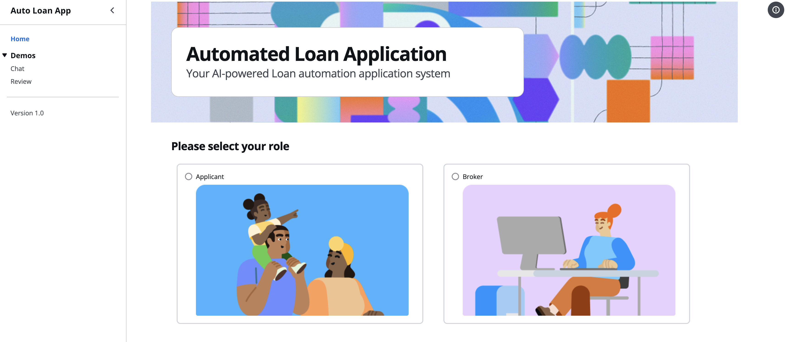

### Scenario 1: Loan Applicant Portal - Generative AI guided experience for loan applicant

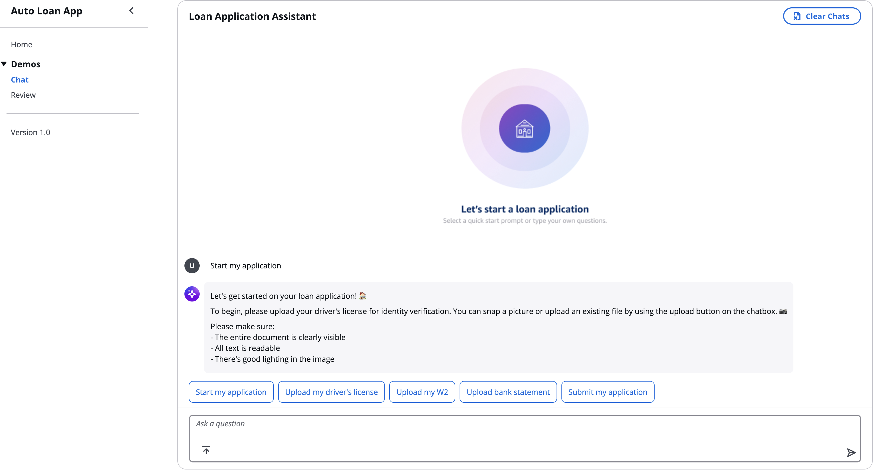

John logs into the applicant portal to initiate his auto loan application, where an AI agent guides him through document requirements and instantly validates his uploaded drivers license, pay stubs, W-2s, bank statements and investment statements, providing real-time feedback on document quality and completeness while flagging any materials that need to be resubmitted.

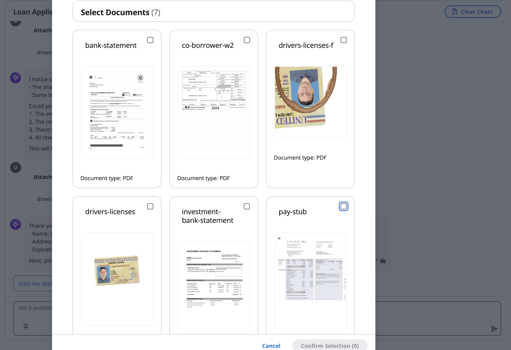
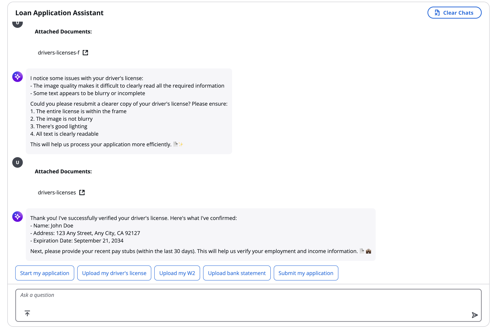
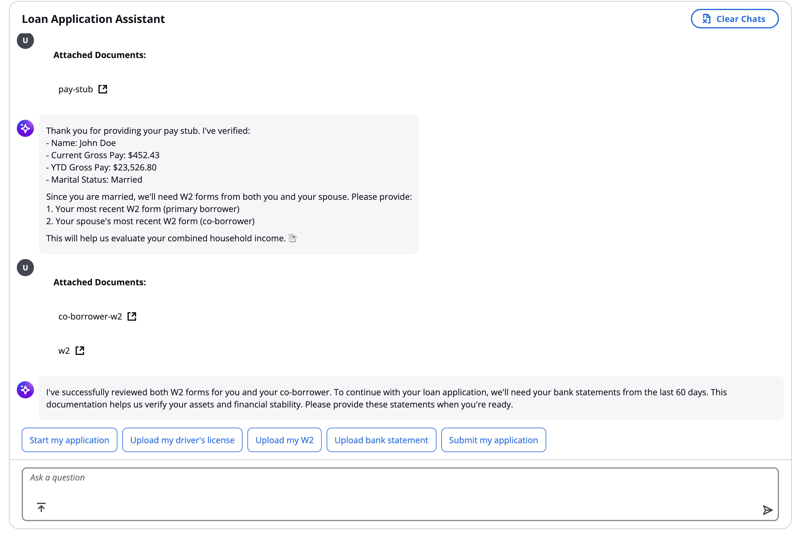

As John progresses, the AI agent tailors its inquiries based on his specific situation, requesting key information such as the property purchase price and his current debts, then computes his DTI ratio to streamline the broker's assessment.

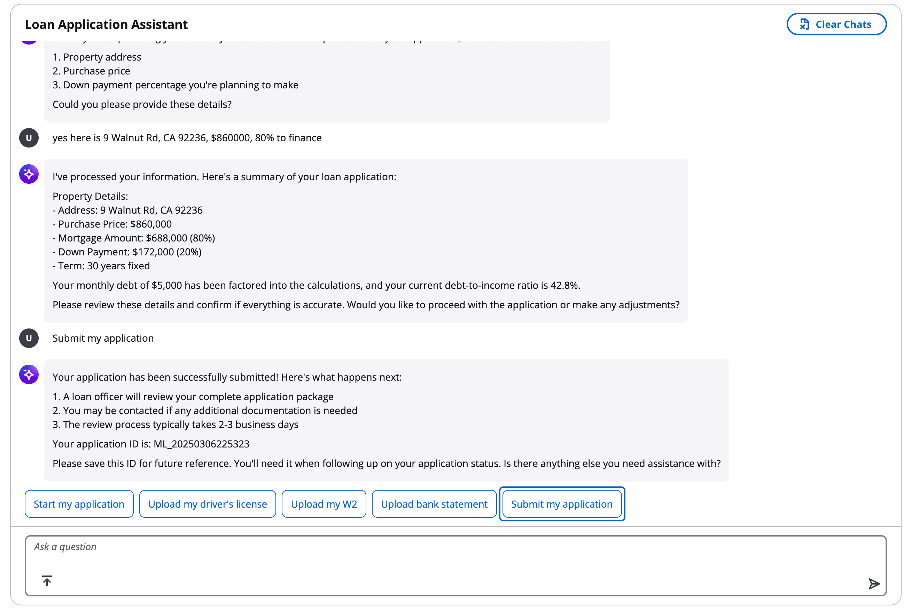

### Scenario 2: Broker Portal

Rebecca logs into the broker portal where the AI agent has organized her dashboard with active loan applications, prioritizing them based on processing status, and required actions.

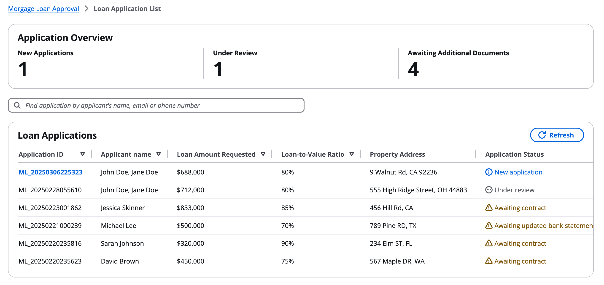

Rebecca accesses John's comprehensive application through a single dashboard where the AI agent presents an analysis of his loan application. The intelligent interface displays an AI-generated executive summary highlighting critical findings, including automated income verification status with supporting documentation, DTI ratio analysis with clear visual indicators (happy/sad faces), and potential risk factors flagged for review. A convenient side-by-side document viewer allows Rebecca to efficiently cross-reference extracted data against original documents, streamlining her verification process.

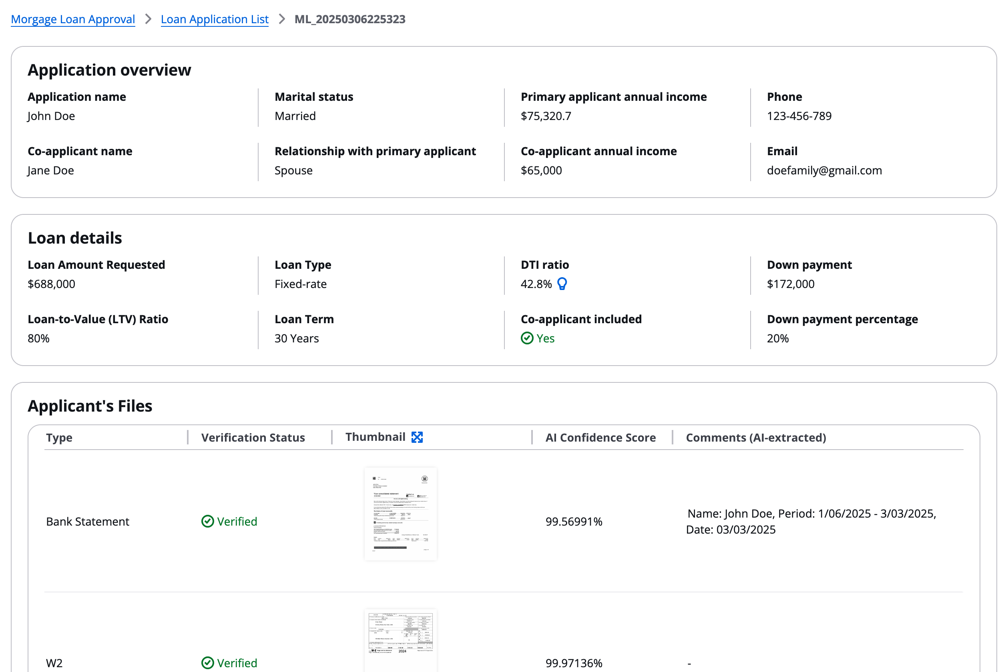
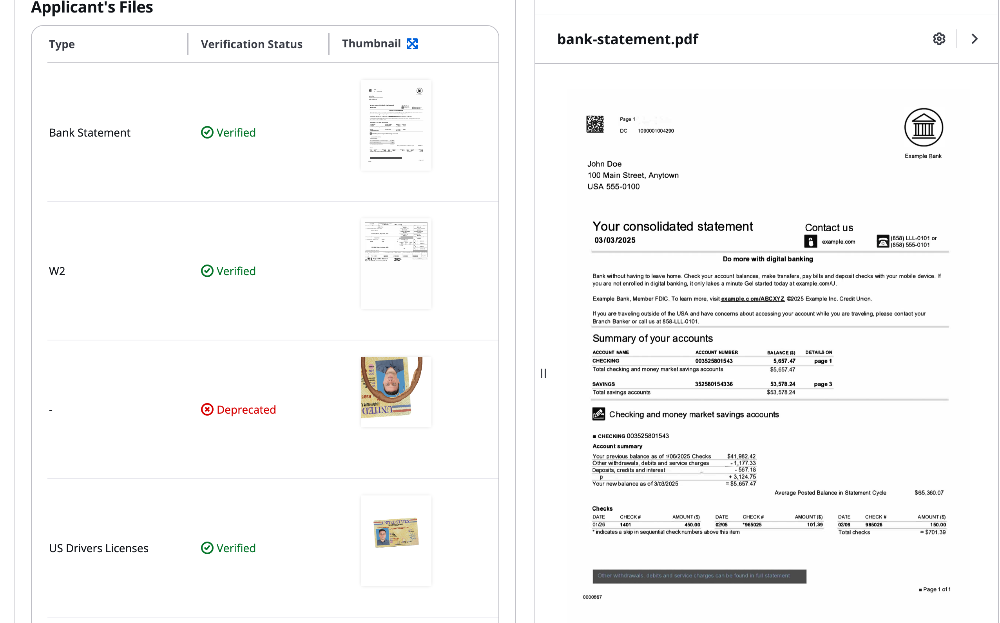
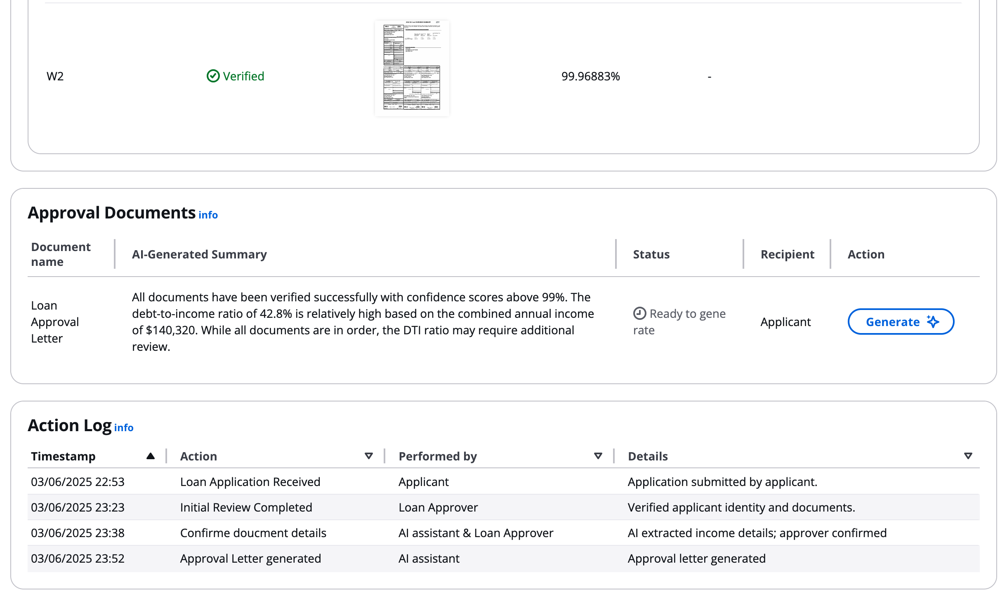

With just one click of the 'Generate' button, Rebecca initiates the AI-powered letter generation process, which automatically populates a formatted pre-approval letter with John's verified information, including purchase price, loan amount, and terms extracted from his application data. The AI agent ensures accuracy by cross-referencing multiple data points while maintaining compliance with regulatory requirements and bank policies.

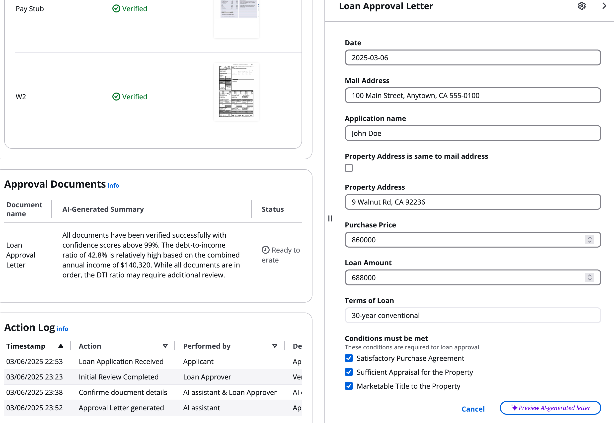

Rebecca reviews the AI-generated pre-approval letter through a preview interface, where she can verify all auto-populated fields and terms before clicking 'Send,' which automatically delivers the secure document to John's email.

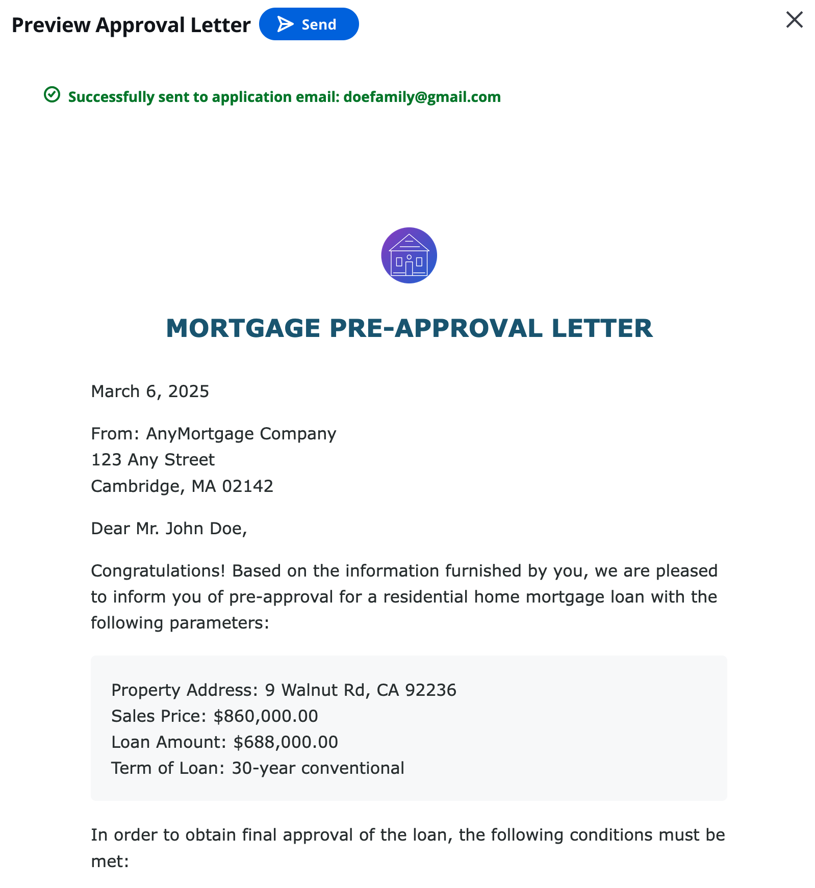